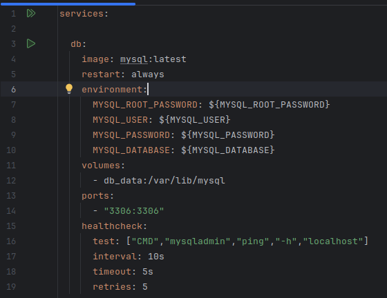
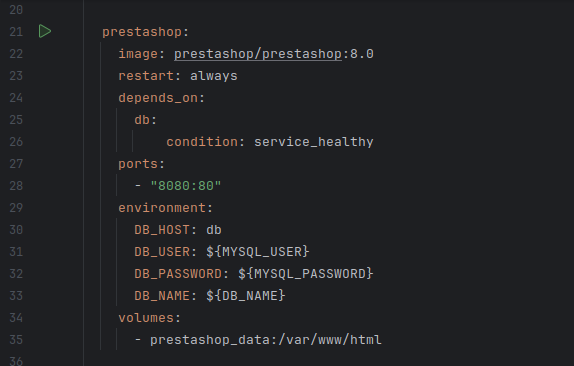
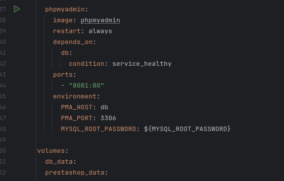
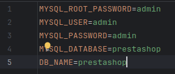
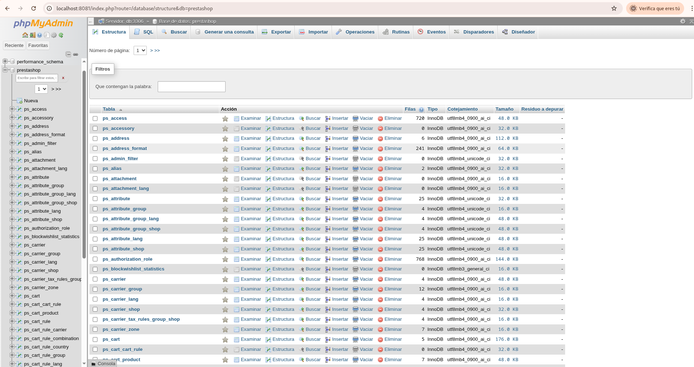

En el yml creamos la base de datos con sus variables de entorno, la imagen de mysql le hacemos un healthcheck y le asignamos su volumen

Hacemos también la configuración de prestashop para que depende de "db" y compruebe su estado con healthcheck.

Por último hacemos la configuración de phpmyadmin con la imagen phpmyadmin que también depende de "db" y comprueba su estado con healthcheck.

Las variables de entorno se implementan desde la interfaz ".env", de forma que estén más seguras.

Para ejecutar el código, usamos el comando docker compose up -d.

Al ejecutarlo y buscar el localhost:8080, debemos installar prestashop y conectarlo a nuestra base de datos.

Al realizar la instalación a través de iniciar sesión en phpmyadmin con el localhost:8081, veremos nuetra base de datos.

